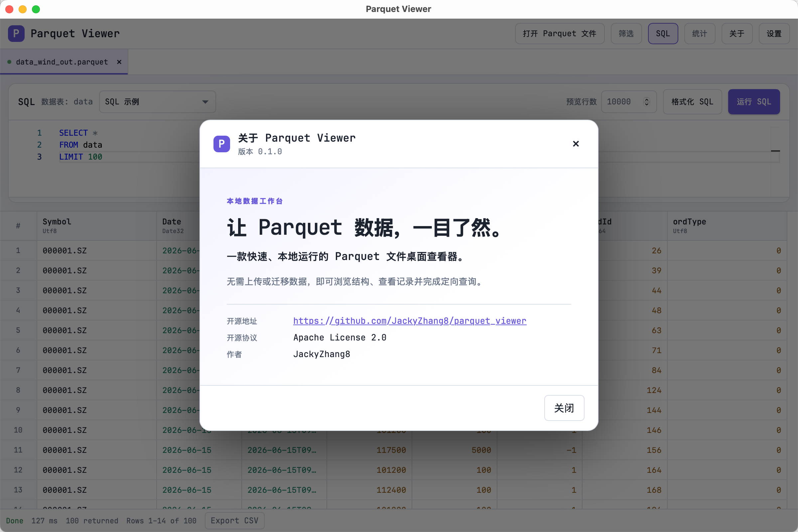

# Parquet Viewer

<p align="center">
  <strong>一个快速、纯本地、只读的 Parquet 文件桌面查看器。</strong><br />
  不用上传数据，即可浏览字段、预览记录、筛选、运行 SQL 并导出 CSV。
</p>

<p align="center">
  <a href="https://github.com/JackyZhang8/parquet_viewer/actions/workflows/ci.yml"></a>
  
  
  
</p>

<p align="center">
  
</p>

> [!NOTE]
> 项目当前处于 `0.1.0` 的早期阶段。欢迎试用和反馈，也欢迎参与共建。

## 为什么做这个工具？

Parquet 文件通常需要借助 Notebook、数据库或命令行才能快速查看。Parquet Viewer 希望把这一步变得更轻：打开本地文件后，便可以直接了解 Schema、浏览数据、组合筛选或写一段 SQL。

它适合数据分析、数据工程和开发调试中临时检查 `.parquet` 文件的场景，也适合不希望把敏感数据上传到第三方服务的工作流。

## 核心功能

- **本地只读**：原始 Parquet 文件不会被修改、替换或上传。
- **多文件标签页**：可通过文件选择器或拖拽同时打开多个文件；重复打开同一路径时会定位到已有标签页。
- **快速了解文件**：读取文件大小、记录数、Row Group 数量和字段 Schema，无需先把整份数据加载到内存。
- **大文件预览**：按批读取，配合行列虚拟滚动，减少浏览大表时的页面负担。
- **可视化筛选**：按字段类型构造条件，支持比较、包含、前缀/后缀、空值判断等操作。
- **只读 SQL**：内置 DuckDB 与 Monaco Editor，支持 SQL 格式化、字段补全和错误定位。
- **结果导出**：把当前筛选或 SQL 的完整结果导出为 CSV；导出过程可取消。
- **实用体验**：支持中文 / English、浅色 / 深色主题、列显示控制、复制单元格或选区，以及外部文件变更提醒。
- **工作区恢复**：可恢复已打开的标签页、SQL 草稿、筛选、排序和布局；恢复后不会自动重新执行查询。

## 快速开始

### 使用已构建的应用

发布版本准备就绪后，可从 [Releases](https://github.com/JackyZhang8/parquet_viewer/releases) 下载对应平台的安装包。当前也可以在 GitHub Actions 的构建产物中获取未签名的测试包。

打开应用后：

1. 点击“打开文件”，或直接把一个或多个 `.parquet` 文件拖进窗口。
2. 在表格中浏览数据；点击“统计”查看文件信息与字段结构。
3. 点击“筛选”使用条件构造器，或点击“SQL”编写查询。
4. 查询完成后，使用结果区的导出按钮保存为 CSV。

### 从源码运行

#### 环境要求

- Node.js 20 或更高版本（CI 使用 Node.js 22）
- Rust stable 工具链
- 对应操作系统的 [Tauri 2 系统依赖](https://v2.tauri.app/start/prerequisites/)

```bash
git clone https://github.com/JackyZhang8/parquet_viewer.git
cd parquet_viewer
npm ci
npm run tauri dev
```

macOS / Linux 用户也可以运行 `./dev.sh`。该脚本会在依赖缺失时安装前端依赖，并自动选择从 `1420` 开始的可用开发端口。

## SQL 使用说明

当前打开的 Parquet 文件会映射为固定表名 `data`。例如：

```sql
-- 预览前 100 行
SELECT *
FROM data
LIMIT 100;
```

```sql
-- 按条件聚合
SELECT category, COUNT(*) AS total
FROM data
WHERE created_at >= DATE '2026-01-01'
GROUP BY category
ORDER BY total DESC
LIMIT 20;
```

为保证本地文件安全，SQL 有明确边界：

- 仅接受一条 `SELECT` 或 `WITH ... SELECT` 查询；不支持 `INSERT`、`UPDATE`、`DELETE`、DDL 等写操作。
- 查询只能读取当前文件的 `data` 表或其 CTE；不能跨文件、跨 Schema / Catalog 查询。
- 禁止文件、网络和扩展相关的 DuckDB 函数，例如 `read_parquet`、`read_csv`、`http_get`。
- 预览查询不支持 `OFFSET`；请用 `LIMIT` 控制返回量。

## 隐私与安全

Parquet Viewer 的设计目标是让数据保留在你的电脑上：

- 不包含上传、云同步或远程数据源能力。
- SQL 引擎的外部访问和扩展自动加载已关闭。
- 文件路径和筛选值使用参数绑定；字段标识符会校验与转义。
- 查询结果、嵌套层级、字符串和 IPC 负载都有大小限制，避免意外占满内存。
- CSV 会先写入同目录临时文件，成功后才替换目标文件，降低中断导致半成品文件的风险。

请注意：应用会在本机保存设置和工作区信息（例如已打开文件路径、SQL 草稿与筛选条件）。处理高敏感数据前，请根据自身设备和权限策略评估这一行为。

## 技术栈

| 层级 | 主要技术 |
| --- | --- |
| 桌面壳 | [Tauri 2](https://v2.tauri.app/) |
| 前端 | React、TypeScript、Vite、Zustand |
| 数据处理 | Rust、Apache Parquet、嵌入式 DuckDB |
| 编辑与表格 | Monaco Editor、TanStack Virtual |

## 构建与测试

在仓库根目录执行：

```bash
# 前端测试与构建
npm test -- --run
npm run build

# Rust 格式、静态检查与测试
cargo fmt --manifest-path src-tauri/Cargo.toml -- --check
cargo clippy --manifest-path src-tauri/Cargo.toml --all-targets -- -D warnings
cargo test --manifest-path src-tauri/Cargo.toml

# 打包当前平台应用
npm run tauri build
```

构建产物位于 `src-tauri/target/release/bundle/`。macOS 上也提供了面向 Windows x64 的交叉编译脚本：

```bash
./build-win.sh
```

该脚本可在 macOS 上交叉编译 Windows x64 可执行文件，不生成 NSIS 安装包。产物位于 `src-tauri/target/x86_64-pc-windows-msvc/release/parquet-viewer.exe`；如需分发，可将该文件与说明文档一起压缩发布。脚本需要 macOS、Rustup、`cargo-xwin` 和 Homebrew LLVM；详细的自动化检查、冒烟测试与大文件基准记录方式请见 [docs/testing.md](docs/testing.md)。

## 开发与贡献

欢迎提交 Issue、功能建议和 Pull Request。在开始较大的改动前，建议先创建 Issue 说明使用场景和预期行为，避免重复工作。

提交 PR 前请至少完成与改动相关的测试，并确保以下检查通过：

```bash
cargo fmt --manifest-path src-tauri/Cargo.toml -- --check
cargo clippy --manifest-path src-tauri/Cargo.toml --all-targets -- -D warnings
cargo test --manifest-path src-tauri/Cargo.toml
npm test -- --run
npm run build
```

## 当前范围与计划

本项目聚焦“**查看与查询单个本地 Parquet 文件**”。当前 MVP 有意不包含以下能力：

- 编辑或写回 Parquet 文件
- 远程数据源、目录数据集与跨标签页 Join
- 图表、Notebook 与 ETL 工作流

如果这些能力对你很重要，欢迎通过 [Issues](https://github.com/JackyZhang8/parquet_viewer/issues) 说明具体场景；它们会作为后续规划的重要参考。

## 开源协议（License）

本项目采用 [Apache License 2.0](LICENSE) 开源。

---

如果 Parquet Viewer 对你有帮助，欢迎给仓库点个 Star，也欢迎分享你的使用反馈。⭐
